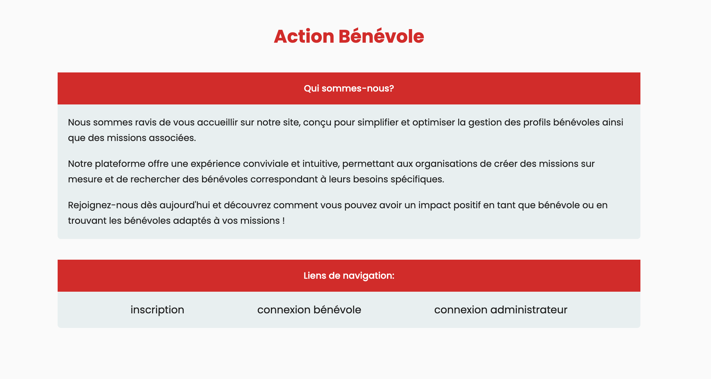
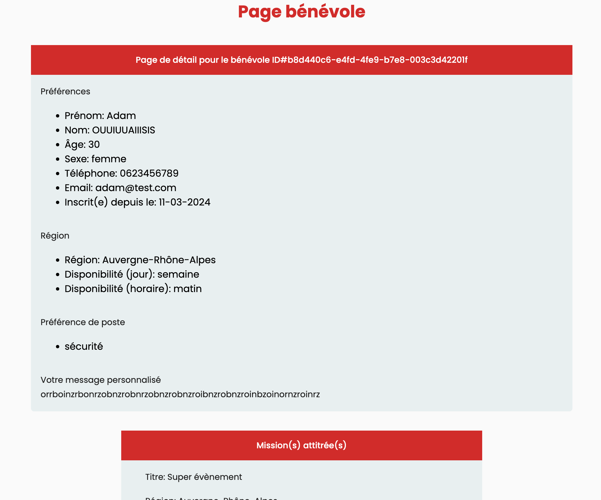
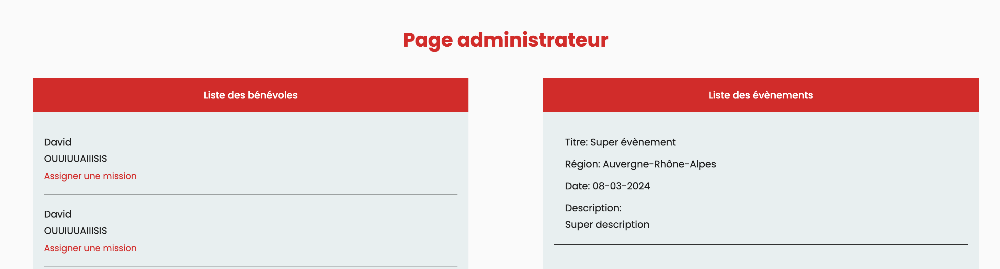
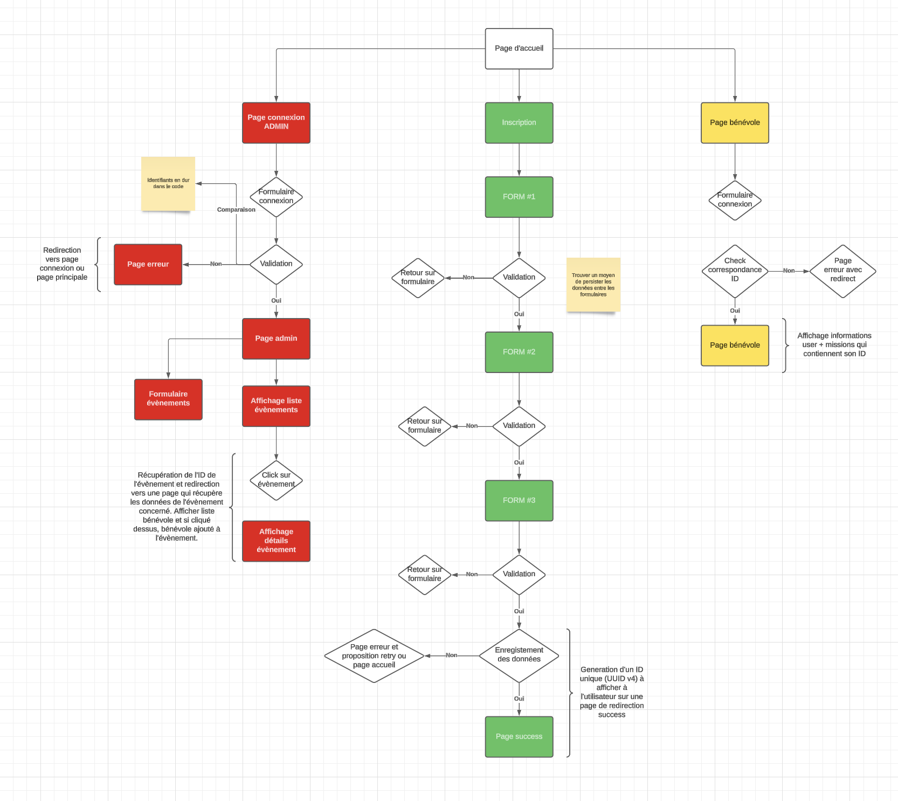
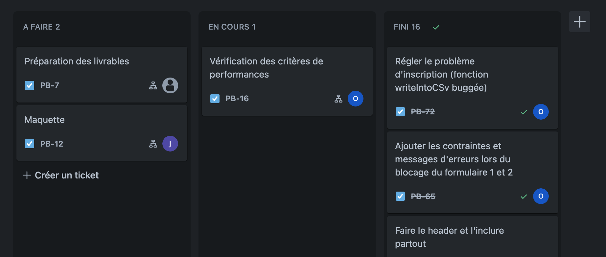

# Gestion-benevole

Une application web pour la gestion de bénévoles et d'évènements.

Le but du projet était de développer:

- ​un parcours d’inscription du bénévole.
- un panel d’administration des listes de bénévoles.

En respectant des contraintes parmi lesquelles:

- Restriction/autorisation pour les pages avec $\_SESSION.
- Validation et contraintes des formulaire en combinant les attributs HTML, Javascript pour la vérification front-end et PHP pour la vérification et la désinfection des données côté back-end.
- Redirections et messages d'erreur/succès pour les pages.
- Enregistrement des données en interaction avec des fichiers CSV.
- Utilisation des variables superglobales de PHP
- Utilisation de la programmation orientée objet

Pour plus de détails, le cahier des charges est disponible en racine du projet.

## Outils

- PHP
- Javascript
- CSS
- Fichiers CSV
- [PhpMyAdmin](https://www.phpmyadmin.net/) pour le server PHP local
- [Lucidchart](https://lucidchart.com/) pour le schéma du projet
- Google Fonts: ['Poppins'](https://fonts.google.com/specimen/Poppins?query=poppins)

## Illustrations

